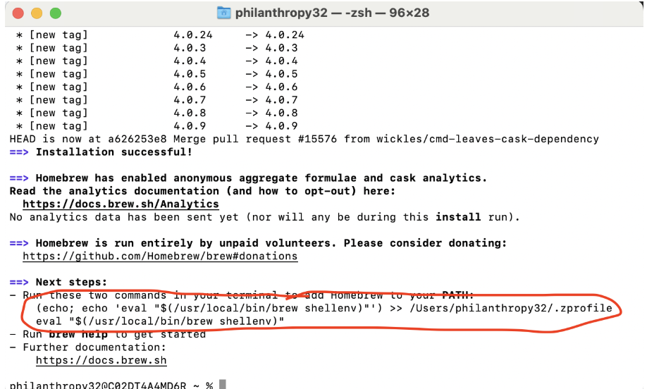

# Set up your Snap computer

## Downloading Google Chrome

1. Download the [Google Chrome web browse]("https://www.google.com/chrome/") (most used by web developers because of the debugging tools)
2. Use the “Chrome Profile” system to make two profiles, one signed in to your personal email and another signed in to your Snap email

## Locate your Terminal

1. Go to the Spotlight (magnifying glass icon) in the upper right hand corner.
   

2. Search for "Terminal" and select into the first application that pops up.

You should open something like this:

## Installing through the terminal

1. Install these tools/programs:

- Homebrew - https://brew.sh/

Homebrew is a program that is used to install and update other software tools and programs. It’s basically ubiquitous for Mac programmers at this point, and it saves a lot of headache. Think of it as an “Amazon but for programming tools” (minus the evil CEO overlord)

This will take a while, especially “Xcode Command Line Tools”

2. (INSERT GENALPHA EMOJI HERE) WHILE YOU WAIT, you can play this game called Bashcrawl to learn more about how to use the Terminal.

- <details>
    <summary>Terminal Game</summary>Follow the instructions on the readme in this [repository](https://github.com/Snap-Engineering-Academy-2026/lab-terminal-adventure) 
  </details>

3. When it finishes, follow the instructions to “Add Homebrew to your PATH” – It’s running the two commands circled here:
   

<!-- - Verify homebrew is working with the brew doctor command -->
<!-- - You should get the message “Your system is ready to brew.” -->
- You can verify if homebrew installed by typing "brew --version" (you should see something like Homebrew 6.0.2)


4. Let's install yarn <br>
   Yarn is a “package manager” for Node projects, so it helps install and update programs (called “packages”) used in Node projects. In the same way homebrew helps install generic programming tools, yarn helps install Node-specific programming tools. We will use homebrew to install yarn, and later use yarn to install other things. This sounds absurd, but such is the life of dev setup / onboarding.
   <br>

- Install yarn with homebrew [find the homebrew command!](https://classic.yarnpkg.com/lang/en/docs/install/#mac-stable)

5. Verify yarn was installed with yarn --version
   You should get a response with a version like “1.22.22”

## Installing Visual Studio Code

Visual Studio Code is the code editor that we will use to develop all of the projects in this class. It’s the most commonly used editor for web and mobile developers by far, and it’s very common for many other kinds of software projects too.

- Install with homebrew:

```
brew install --cask visual-studio-code
```

Check that the installation succeeded by opening VSCode from the terminal with:

```
code
```

## Installing Node/ Node Version Manager (nvm)

Node is the “engine” that powers websites with more complicated JavaScript code, and it’s required to develop React and React Native applications. Node has many versions and sometimes you’ll need to switch to different versions depending on the project you’ll be working on. Node Version Manager helps with that, but to start we’ll just be using it to install the latest stable version of node.

1. Run the installation command for [Node Version Manager]
   (https://github.com/nvm-sh/nvm#installing-and-updating)

2. Restart your terminal (you do actually need to do this, I promise)

3. Install the latest stable version of node with

```
nvm install --lts
```

Verify that Node and nvm are working with the command `nvm ls`
If you get an output with lots of colors and numbers, you’re good

## Installing AI Tools
1. Navigate to [Codex](https://chatgpt.com/codex/?utm_source=google&utm_medium=paid_search&utm_campaign=GOOG_X_SEM_GBR_Codex_CDX_BAU_ACQ_PER_MIX_ALL_NAMER_US_EN_111325&c_id=23226110534&c_agid=194939268903&c_crid=807810285009&c_kwid=kwd-21294781&c_ims=&c_pms=9192409&c_nw=g&c_dvc=c&gad_source=1&gad_campaignid=23226110534&gbraid=0AAAAA-I0E5cbivlmuXT8QqgAeyG5L9THf&gclid=CjwKCAjw6MPRBhBTEiwAd-7Mr37krSeGn6Fj7dxfOUTcNrfirrPzkg7v49xQBDONPDRNglqkna9KWhoCc8EQAvD_BwE) and download the desktop app. Let's also add Codex to our vsCode. In vsCode navigate over to the extentsion tab and search `Codex – OpenAI’s coding agent`. Hit install!
2. Read more about Codex [here](https://developers.openai.com/codex/ide)

2. Installing Cursor 
- Navigate to [cursor](https://cursor.com/) and download the desktop app.


