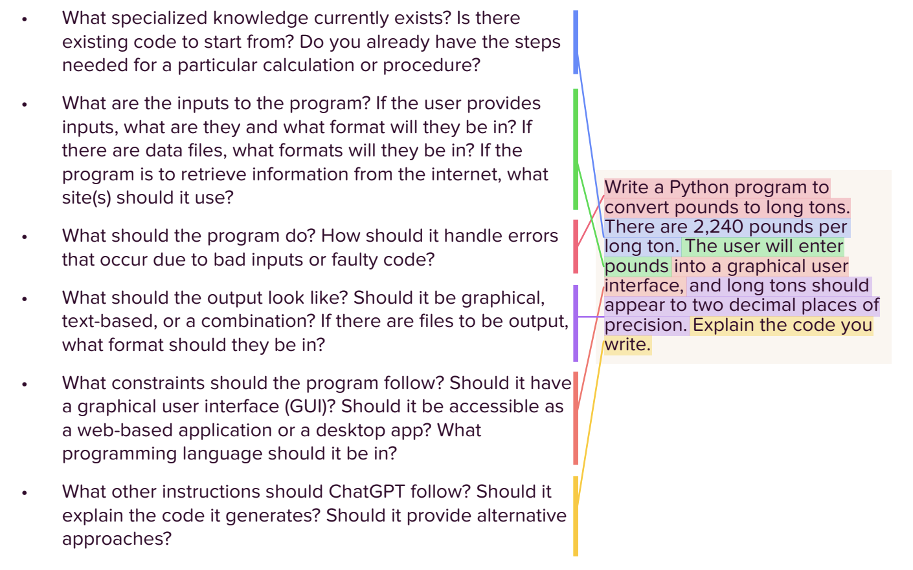

# Snap Uses Google - let's dive in

### What is Prompt Engineering

Prompt engineering is the art and science of designing and optimizing prompts to guide AI models, particularly LLMs, towards generating the desired responses. By carefully crafting prompts, you provide the model with context, instructions, and examples that help it understand your intent and respond in a meaningful way. Think of it as providing a roadmap for the AI, steering it towards the specific output you have in mind.

## Reading Time!

Let's see what Google advises us to have in our prompts. Check out the documenation [here](https://cloud.google.com/discover/what-is-prompt-engineering#use-cases-and-examples-of-prompt-engineering)

# Prompt Engineering - What you say Matters

## What should we consider when writting a prompt for building code?

When building a prompt for ChatGPT to generate code, make sure
you consider including the following elements:
 
\*\* Some prompts might not require all of the elements, and there's no requirement to put the elements in any particular order. \*\*

1. What specialized knowledge currently exists? Is there existing code to start from? Do you already have the steps
   needed for a particular calculation or procedure?
2. What are the inputs to the program? If the user provides inputs, what are they and what format will they be in? If there are data files, what formats will they be in? If the program is to retrieve information from the internet, what site(s) should it use?
3. What should the program do? How should it handle errors that occur due to bad inputs or faulty code?
4. What should the output look like? Should it be graphical,text-based, or a combination? If there are files to be output,
   what format should they be in?
5. What constraints should the program follow? Should it have a graphical user interface (GUI)? Should it be accessible as a web-based application or a desktop app? What
   programming language should it be in?
6. What other instructions should ChatGPT follow? Should it explain the code it generates? Should it provide alternative
   approaches?

## Let's see it in Action

## AI Time to Shine

You are going to work with SSA!
